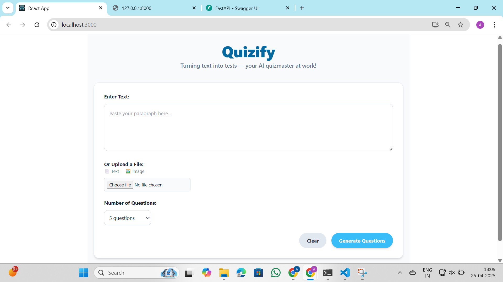
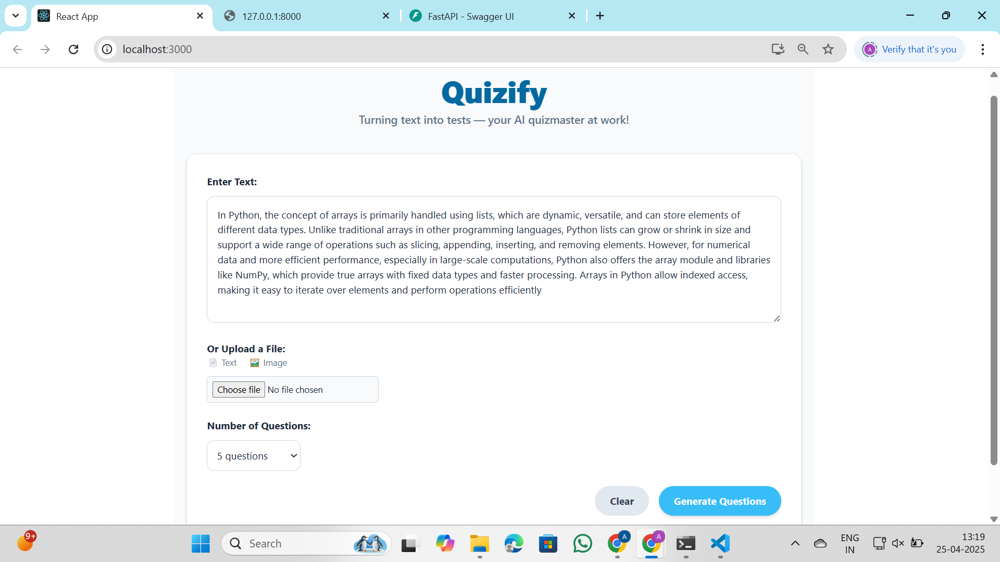
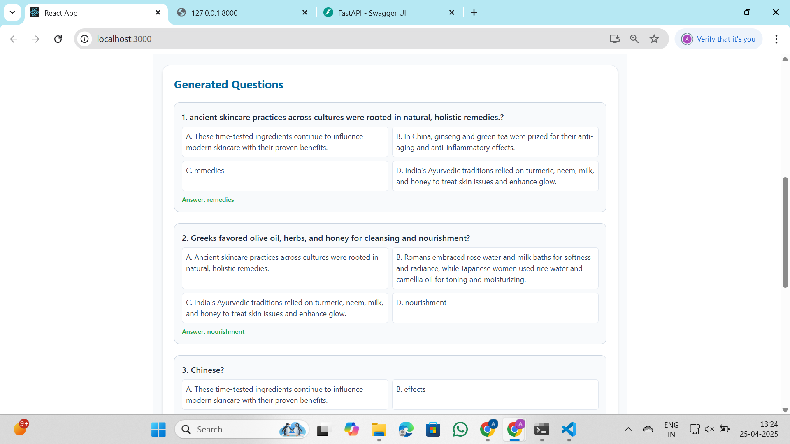

# 🎓 Quizify-Automatic MCQ Generator

Welcome to **Quizify-Automatic MCQ Generator**, an intelligent web application that automatically creates multiple-choice questions (MCQs) from any given text.  
Built for students, educators, and learners — making quiz creation effortless and efficient!

---

## 🚀 Features

- 🔍 Extracts questions and answers from any provided paragraph or document
- 🤖 Uses Natural Language Processing (NLP) techniques to generate MCQs
- 🧠 Automatically creates meaningful distractors (wrong options)
- 💻 Frontend built with **React.js + Tailwind CSS**
- 🐍 Backend powered by **Python (FastAPI) + NLP models**
- 🎯 Clean and simple UI for smooth user experience

---

## 🖥️ Tech Stack

| Frontend       | Backend    | NLP Engine        |
|----------------|------------|-------------------|
| React.js       | FastAPI     | Custom MCQ Models |
| Tailwind CSS   | Python      | Text Tokenizers   |
| JavaScript (JSX)| REST API   | NLP Techniques    |

---

## 📸 Screenshots

---

### 🏠 Home Page



---

### 🧠 Text_Input



---

### 📄 Generated_Output - 1



---

### 📄 Generated Questions - Part 2


---

## ⚙️ How to Run Locally

### 1. Clone the Repository

```bash
git clone https://github.com/Akshaysai-code/Quizify.git
cd Quizify
```

 ### 2. Run the Frontend

```bash
cd frontend
npm install
npm start
```

> Make sure you have Node.js and npm installed.

### 3. Run the Backend

```bash
cd backend
pip install -r requirements.txt
uvicorn main:app --reload
```

> Ensure Python and pip are installed in your environment.

---

## 📂 Project Structure

```
Quizify/
|
images/
|
frontend/
│
├── App.js
├── index.js
├── index.css
├── tailwind.config.js
├── components/
│   ├── MCQGenerator.js
│   └── OtherComponents.js
│
backend/
│
├── main.py
├── database.py
├── models.py
├── MCQGenerator.py
```

---

## 📈 Future Enhancements

- 📝 Export generated quizzes to PDF/Word
- 🧠 Upgrade MCQ generation using larger language models (e.g., GPT-4)
- 🎮 Add gamification features (timed quizzes, scores)
- 🔒 User authentication and quiz history tracking

---

## 🙌 Contributing

Contributions are welcome!  
Please open an issue first to discuss what you would like to change.  
Feel free to fork, create a pull request, or suggest improvements.

---

## 📜 License

---

# ✨ Thank you for checking out Quizify!
